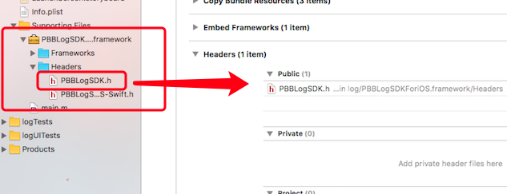

暂时支持OSX系统：
依赖库及版本：pod 'RNCryptor', '~> 5.0.1'   //实现aes密钥加密

改进：OC中支持枚举（日志类型，登录类型，APP类型，网路类型）
## 方法介绍

### 第一种：工厂模式（仅支持Swift）
使用PBBLogAPI工厂提供单例模式上传，主要考虑日后扩展：
    let url = "http://192.168.85.92:8099/HostMonitor/client/log/addLog"
    let model = PBBLogModel.init(.FATAL, in: .ReaderMac, desc: "dddd")    ／／日志描述
    PBBLogAPI.shareInstance.upLoadLog(to: url, logModel: model)             ／／上传

### 第二种：LogModel实例单行上传
主要是对LogModel实例赋予了上传功能：
    swift ：PBBLogModel(.INFO, in: .ReaderMac, desc: "申请激活+1").sendTo()    //上传到指定服务器：.sendTo(server:"URLString")
    object-c：[[[PBBLogModel alloc] inittWithType:LogINFO inApp:APPReaderMac desc:@"查看文件时，更新数据库中的本地路径"] sendToServer];  //不支持指定服务器

## 使用说明
* 第一步：下载程序包，拖入项目
* 第二步：在（swift ／OC）中使用
### OC中使用
导入：`#import "PBBLogSDK.h“`
调用：
```objc
[[[PBBLogModel alloc] inittWithType:LogINFO inApp:APPReaderMac desc:@"查看文件时，更新数据库中的本地路径"] sendToServer]
```
> 注：由于swift 枚举类型和OC枚举类型的差异，暂时有数字代替，映射到swift枚举中。
映射具体实现：
    case 1:  logType = .FATAL  
    case 2:  logType = .ERROR     
    case 3:  logType = .WARN       
    case 4:  logType = .DEBUG 
    default: logType = .INFO

### swift 使用
导入：`import PBBLogSDK`
调用：`PBBLogModel(.INFO, in: .ReaderMac, desc: "申请激活+1").sendTo()`


IOS支持：安装需要步骤：


单元测试效果，上传到服务器的数据如下：
    xctest[55959:896729] {
    "application_name" : "Reader for OS",
    "device_info" : "huoshug.local",
    "extension1" : "",
    "token" : "Mac token",
    "description" : "",
    "file_name" : "PBBLogSDKTests.swift",
    "imei" : "9CD72BC0-6A49-516F-AC8C-C0D10796535A",
    "level" : "INFO",
    "system" : "Mac",
    "extension3" : "",
    "username" : "Mac user",
    "content" : "11\/28\/2016 12:18:22:002 xctest[55959:?] \/Users\/pengyucheng\/git-svn\/PBBReader\/PBBLogSDKTests\/PBBLogSDKTests.swift(49) testMyMethod():\r\查看文件时，更新数据库中的本地路径\n",
    "desc" : "dddd",
    "op_version" : "Version 10.12.1 (Build 16B2555)",
    "equip_serial" : "C07L41M6DWYM",
    "equip_host" : "",
    "account_password" : "AwEjXApASgaC2Oo0sGPvIxcJevU2qO5MiIGP4PMmL00y7t0AZ5zl4uapZ9BtdfKc8bPTXQfANgkg1XpyuD6SpPCaIKGV3VfNcNkEht1WVtR0BQ==",
    "lines" : 49,
    "login_type" : "Mac",
    "method_name" : "testMyMethod()",
    "extension2" : "",
    "account_name" : "",
    "sdk_version" : "10.12.1",
    "equip_model" : "Macmini6,2"
    }

## 进阶加密算法
RNCryptor:
### 如何加密/解密字符串？
AES加密字节。它不加密的字符，字母，文字，图片，视频，cats或ennui。它仅加密byte类型。您需要将其他的东西（如字符串）和bytes类型通过同一种方式相互转换。有几种方法可以做到。一些最受欢迎的是UTF-8编码，Base-64编码，和十六进制编码。还有许多其他的选择。请不要让RNCryptor来推测你使用的编码格式，它不会这么做的。它接受NSData类型并返回bytes类型。
String和utf8编码的NSData互转：
    let data = "sdfhskhfsj".data(using: .utf8)!    // OC: dataUsingEncoding()
    let string = String.init(data: data, encoding: .utf8)!  
String和Base-64编码的NSData互转：
    let data = NSData.init(base64Encoded:"sdfhskhfsj", options: .ignoreUnknownCharacters)
    let string = data.base64EncodedData(options: .endLineWithCarriageReturn)

### 基于密钥的加密 key-based encryption 

您需要一个小的专业知识正确使用基于密钥的加密，并且它是非常容易导致不安全的系统，看起来安全。最重要的规则是，密钥必须是随机的，在所有他们的字节。如果你不熟悉基本概念如AES-CBC加密，IV，和HMAC，你应该避免使用基于密钥的加密。

使用基于密钥的加密，这是一个特定的长度的随机byte序列。RNCryptor V3格式使用256位（32字节）进行加密和认证密钥。

密码不是一个特定长度的“随机字节序列”，它们不是随机的，它们可以是各种各样的长度，很少精确的32。RNCryptor定义一个特定的和安全的方法用于将密码转换到钥匙中，这是它的一个主要特征。 

有时会直接用随机密钥来工作。把一个密码转换成一个密钥是故意慢（几十毫秒）。密码加密的消息也是一个16byte字节的时间要比密钥加密的消息更久一点。如果你的系统对许多短的消息进行加密和解密的额操作，这无疑会对系统的性能造成非常大的影响，特别是在服务器上。 
RNCryptor支持基于密钥加密和解密直接操作，多个密钥的size 和数量可能会改变他们之间的格式版本，所以基于密钥加密是特定的版本加密方式。
为了确保是安全的，密钥必须是一个随机的byte序列。参照Converting a Password to a Key帮助当你只有一个密码时，如何创建byte随机序列。

Best practice security
Wherever possible within the above constraints, the best available algorithms are applied. This means AES-256, HMAC+SHA256, and PBKDF2. (Note that several of these decisions were reasonable for v3, but may change for v4.)
AES-256. While Bruce Schneier has made some interesting recommendations regarding moving to AES-128 due to certain attacks on AES-256, my current thinking is in line with Colin Percival. PBKDF2 output is effectively random, which should negate related-keys attacks against the kinds of use cases we're interested in.
AES-CBC mode. This was a somewhat complex decision, but the ubiquity of CBC outweighs other considerations here. There are no major problems with CBC mode, and nonce-based modes like CTR have other trade-offs. See "Mode changes for RNCryptor" for more details on this decision.
Encrypt-then-MAC. If there were a good authenticated AES mode on iOS (GCM for instance), I would probably use that for its simplicity. Colin Percival makes good arguments for hand-coding an encrypt-then-MAC rather than using an authenticated AES mode, but in RNCryptor mananging the HMAC actually adds quite a bit of complexity. I'd rather the complexity at a more broadly peer-reviewed layer like CommonCryptor than at the RNCryptor layer. But this isn't an option, so I fall back to my own Encrypt-than-MAC.
HMAC+SHA256. No surprises here.
PBKDF2. While bcrypt and scrypt may be more secure than PBKDF2, CommonCryptor only supports PBKDF2. NIST also continues to recommend PBKDF2. We use 10k rounds of PBKDF2 which represents about 80ms on an iPhone 4.
